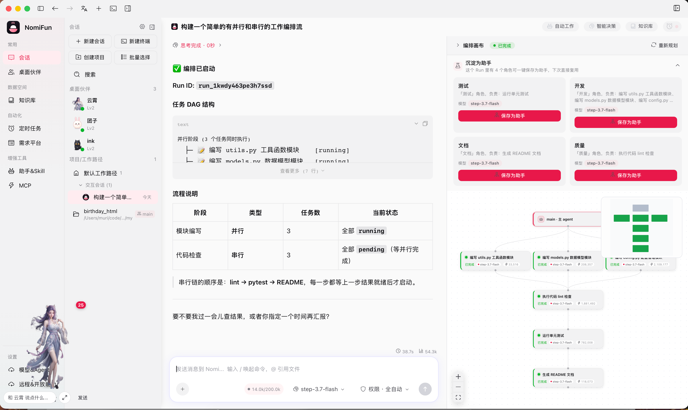

# NomiFun Portal

NomiFun 是一项完全开源、无任何保留的超级 AI 工作站。它把 AI agent、桌面伙伴、模型管理、知识库、Skill、MCP、REST API、WebUI 远程访问、Browser Use、Computer Use、自动工作与需求管理等能力收拢到一个本地优先的工作区里，目标是用丰富的创新能力和极高的生产提效，满足你对 AI 工作站的想象。

本仓库是 NomiFun 官方网站与文档门户源码，主产品源码见 [nomifun/nomifun-tauri](https://github.com/nomifun/nomifun-tauri)。



## 下载与演示

- 官方下载入口：[GitHub Releases](https://github.com/nomifun/nomifun-tauri/releases)
- 中国区备用下载：[百度网盘分享 nomifun](https://pan.baidu.com/s/5GPonoJNrwJ7GciBSDgXLaA)
- 中国区视频播放：[抖音演示](https://www.douyin.com/user/self?from_tab_name=main&modal_id=7657100052061523209) / [B站演示](https://www.bilibili.com/video/BV1kwKZ6UE5X/)
- 海外视频播放：[YouTube](https://youtu.be/AsEToBDFR9s) / [X](https://x.com/colir0/status/2072001821640437776?s=20)

## 核心承诺

### 数据安全：all in local

NomiFun 开源版坚持本地优先：数据全在本地，绝不在用户不知情的情况下主动向外发送任何数据。除了用户明确配置并调用 LLM 服务时，需要把对应上下文发送给模型厂商或用户自行配置的模型服务外，默认核心工作流不主动对接其它第三方服务网络请求。

如果用户主动启用 IM 渠道、Webhook、外部知识源、远程 MCP / REST API、WebUI 远程访问等开放能力，相应网络访问只应由用户配置和授权触发。NomiFun 的安全目标不是替用户隐藏外联能力，而是让每一次外联都有清晰入口、明确配置和可审计边界。

这不是一句营销口号，而是产品取舍。为了保障用户和开发者的数据安全，开源版砍掉了很多先进、有意思、也很惊艳的功能设计。原因很简单：如果没有足够的人力、资金和长期维护能力去保障这些能力在所有场景下都足够安全，就不应该把它们贸然开放给每一个关注数据安全的个体和企业。

代码完全开源，接受审计。关注数据安全的个人、团队和企业都可以放心使用，也欢迎从代码、网络请求、数据存储、鉴权边界等角度持续审查。

### 完全开源，允许二次开发与商用

NomiFun 坚持源码开放、无任何保留，允许个人和企业二次开发、内部使用和商业化使用。

如果你基于本项目进行二次开发并商用，后续产生的一切法律、合规、经营和交付风险由使用方自行承担，本项目作者及贡献者不承担相关责任。

二次开发和商用不需要额外授权。如果你愿意留言告知作者，这不是授权流程，也不是限制条件，只是希望得到一份认可和正向反馈，让项目生态价值被更多人看见。

### 无广告、无会员、无功能收费

NomiFun 承诺不会对用户收取本项目任何功能费用，也不会做会员制、功能分层或广告变现设计。

目前唯一可能产生费用的是模型供应商 token 成本，这是调用大模型时不可避免的客观成本，并非 NomiFun 项目本身收费。NomiFun 不对模型调用本身收费，也不会默认接入统一商业模型服务。

### 持续迭代，欢迎共建

NomiFun 还有很多令人期待的 feature 没有上线。项目开发者目前处于兼职开发状态，精力有限，因此迭代速度、bug 修复速度和文档补齐速度都可能不达预期。

欢迎对这个项目有热情、有激情的同学加入共建。当前尤其需要代码贡献者、产品共创者、社区运营、文档维护者和布道者，一起壮大 NomiFun 的能力、生态和组织。

## 一句话介绍

NomiFun 是一项完全开源、无任何保留的超级 AI 工作站。丰富的创新能力，极高的生产提效，满足你对 AI 工作站的想象。

- 源码开放，数据全在本地，个人和企业都能放心使用，免费商用，毫无保留。
- 超级伙伴，智能进化，无限懂你，不只是伙伴，还是真正的生产力工具。
- 智能值守，需求管理，你只管指挥，它会可靠为你工作。
- 开放能力，超级生态接入，什么都有，什么都能用，什么都能与它配合。
- 无限搭配，统一知识库、Skill、Agent、MCP、模型管理能力，config one, use anywhere。
- 更 native 的实现，更 native 的使用，内嵌 Computer Use、Browser Use 能力。
- 专为提效设计，从实际需求出发，还有海量创新能力，敬请期待。

## 创新能力

> NomiFun 仍处于 pre-1.0 快速迭代阶段。下面介绍的是开源版已经落地、正在开放和预留中的核心方向，具体可用范围以当前 release、官网文档和代码为准。

### 1. 桌面伙伴与智能养成体系

NomiFun 的桌面伙伴不是一个装饰性的桌宠，而是可以持续进化的生产力入口。

- 可以自定义伙伴形象，提供更友好的陪伴式交互体验。
- 每天的使用过程都可以成为伙伴理解你的上下文，数据采集行为由用户控制，让伙伴在安全边界内更懂你。
- 支持多个伙伴：既可以共享记忆，也可以拥有不同领域的专家知识库和专属技能。你可以只教会一个伙伴，再让它帮助其它伙伴学习。
- 伙伴能够从真实工作流中总结 Skill，生成 Skill 草稿并与你商议，多个伙伴之间也可以开启 Skill 共享学习。
- 每个伙伴都可以成为一个超级网关：作为独立个体连接 IM channel、WebUI、MCP、REST API 和系统能力。只要有网络与社交平台，你就可以远程指挥伙伴帮你操作电脑、处理任务、调用系统级能力。

### 2. 需求平台、AutoWork 与 IDMM

NomiFun 通过需求平台、自动工作 AutoWork 和智能决策 IDMM，把任务从“人盯人执行”推进到“需求轮转、可靠保活、无人值守”的工作方式。

- 支持把需求集中管理，减少散落在聊天、issue、文档和临时待办里的上下文损耗。
- AutoWork 可以围绕需求持续推进、轮转和保活，让用户只需要指挥目标，而不是守着每一步执行。
- IDMM 用于在复杂任务中做智能决策、拆解和调度，让系统更像一个可靠的工作站，而不是一次性聊天窗口。
- 后续可继续对接在线 issue、Slack、Lark 等平台，也可以通过 API 接入远端数据作为知识库来源。

### 3. 统一知识库管理

NomiFun 希望把系统中散落的知识集中管理、使用和跟踪。

- 支持统一知识库创建、挂载、使用和追踪。
- 支持安全的知识库回写机制，让沉淀下来的经验能够回流。
- 支持实时 URL 快照知识库，适合把网页、项目资料和动态内容纳入长期上下文。
- 飞书、Notion 等外部知识来源会按安全边界逐步开放。

### 4. WebUI 远程办公

不使用社交平台，也可以通过 WebUI 远程操作电脑。

只需要在本机开启 WebUI，手机或平板扫码登录，就能连接到电脑上的 NomiFun，在移动设备上远程指挥系统为你办公。它适合局域网、VPN、自托管等场景，也适合不想把工作入口绑定到某个社交平台的用户。

### 5. Native Browser Use 与 Computer Use

NomiFun 自研 Browser Use、Computer Use 等系统级 native 能力，以 native tools 的方式为模型提供服务。

相比只靠文本协议和浏览器自动化脚本，native 能力可以提供更细粒度的能力控制、更强的自定义空间、更快的响应速度，并在许多场景下降低 token 消耗。相关代码开源，开发者可以按自己的系统、工作流和安全策略继续增强。

### 6. MCP / REST API 全能力开放

NomiFun 的能力会尽可能 MCP 化、REST API 化、OpenAPI 化。

这意味着 Claude、Codex、任意 agent、脚本、自动化平台或企业内部系统，都可以通过 MCP、Skill 或 REST API 调用 NomiFun 的能力。NomiFun 不只是一个应用，也可以成为其它 agent 的本地能力底座。

### 7. 开箱即用的 Nomi Agent 与 ACP Agent 生态

NomiFun 内置 Nomi Agent，无需额外安装其它 agent 即可开始使用。

它支持大量主流大模型和聚合模型供应商，自研 agent 能够无缝调用系统 native 能力。不仅自研 agent 能用，ACP agent 也能用；不仅交互式会话界面能用，terminal 也能使用。NomiFun 同时支持 ACP 协议直连 Claude、Codex 等主流 agent 工具，并为它们提供模型能力和本地系统能力。

## 官网与文档门户

本仓库维护 NomiFun 官网、下载页、联系页和中英文文档。

技术栈：

- [Astro](https://astro.build/) 5
- React 19 islands
- UnoCSS
- TypeScript
- 静态资源与真实产品截图
- 中英文 i18n 路由：英文在 `/`，中文在 `/zh`（旧 `/en` 入口保留兼容）

常用目录：

```text
src/components/sections/   首页功能区与营销展示模块
src/components/pages/      下载页、联系页、朋友页等页面级组件
src/content/docs/zh/       中文文档内容
src/content/docs/en/       英文文档内容
src/data/                  链接、渠道、模型供应商等结构化数据
src/i18n/                  官网多语言字典
public/brand/              品牌资源
public/images/             产品截图与文档图片
```

本地开发：

```bash
bun install
bun run dev
```

构建与预览：

```bash
bun run build
bun run preview
```

## 官网设计预留

官网设计不会一次到位，也不应该一次定死。这个仓库会尽量保持内容、视觉、资源和数据的清晰分层，为后续反复修改留出空间。

- 首页按功能区拆成独立 section，便于替换首屏、重排叙事和局部重做。
- 文档内容放在 `src/content/docs/`，不和页面结构强绑定。
- 外链、下载入口、社交账号、版本号和许可证信息集中在 `src/data/links.ts`。
- 品牌资源和产品截图集中在 `public/`，方便逐步替换为更高质量的真机素材。
- 复杂交互以 React island 方式局部挂载，避免把整个官网变成重前端应用。
- 设计风格可以持续迭代，但核心信息需要始终围绕本地优先、开源透明、生产提效和能力开放。

如果你要参与官网设计或内容维护，建议先保持模块边界，不要把一次视觉尝试写死到全站基础层里。NomiFun 的官网会经历多轮审美、叙事和信息架构调整，代码结构应该为这种变化服务。

## 贡献方式

欢迎提交 issue、PR、文档修正、截图补充、设计建议和使用反馈。

适合参与的方向：

- 修复官网和文档中的错别字、失效链接、截图缺失和描述不准确。
- 补充真实使用案例、部署经验和企业内部使用经验。
- 改进中英文文档，让更多用户能快速理解 NomiFun 的能力边界。
- 参与主项目功能开发、安全审计、生态适配和社区运营。
- 帮助介绍 NomiFun，让更多关注本地 AI 工作站和数据安全的人知道这个项目。

主产品仓库：[https://github.com/nomifun/nomifun-tauri](https://github.com/nomifun/nomifun-tauri)

## 许可证与免责声明

主产品以 Apache-2.0 许可开源。个人和企业可以基于本项目学习、使用、二次开发和商用，但需要自行承担二次开发、商用、部署、数据处理、模型调用和合规相关风险。

NomiFun 作者及贡献者不对使用方的商业行为、法律合规、数据处理后果、模型输出结果或二次开发交付承担责任。
