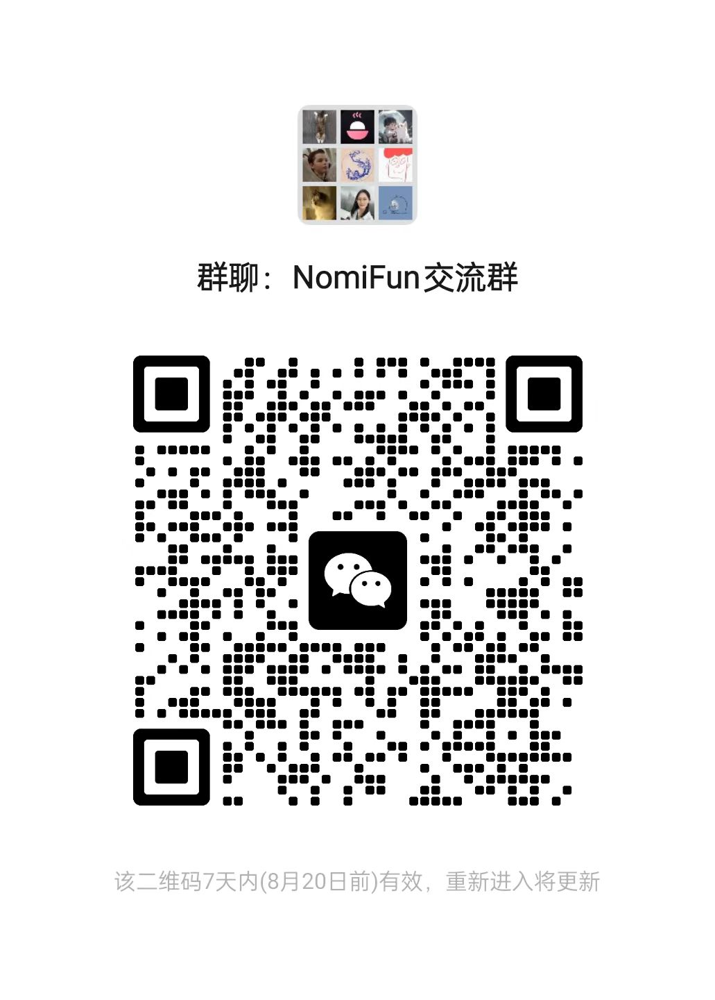

# NomiFun Portal

NomiFun 是一项**完全开源、免费、无商业化限制**的本地优先 Agent
Desktop。它把桌面伙伴、会话协作、模型管理、知识库、Skill、MCP、REST API、
WebUI 远程访问、Browser Use、Computer Use、需求管理、自动工作、创意工坊和
Agent Desktop 小程序放进一套可审计、可扩展的工作站。

本仓库是 NomiFun 官方网站与中英文文档门户源码。NomiFun Desktop、Mobile 与
Xiaozhi Yuntai 共同组成从桌面中枢、无云端移动连接到硬件多模态伙伴的开源产品家族；
源码、官网产品介绍和接入文档见下方的[NomiFun 开源生态家族](#nomifun-开源生态家族)。


## 当前状态

> NomiFun Desktop 当前公开版本为 **v0.6.1**，项目整体仍处于 **pre-1.0** 快速迭代阶段。
> 请以 GitHub Releases、应用「关于」页和当前代码为准。

NomiFun 最初只是作者自用、以及给内容朋友使用的工具；直到 **2026 年完成 UI 重构**
后才逐步开源。它仍然是一个实验性、公益性产品，维护人力有限，因此不会承诺企业级
SLA，也没有强宣传或商业化增长诉求。欢迎使用、审计、二次开发和共建，也请对版本、
稳定性和生产部署保持合理预期。

## NomiFun 开源生态家族

| 项目源码 | 定位 | 官网产品介绍 | 接入文档 |
|---|---|---|---|
| [NomiFun Desktop](https://github.com/nomifun/nomifun-desktop) | 跨平台主工作台与本地中枢：Windows、macOS、Linux；多模型、多 Agent、会话、终端、WebUI、知识库、自动化、小程序和本地伙伴能力。 | [Desktop 产品页](https://www.nomifun.com/zh/products/desktop/) | [Desktop 文档](https://www.nomifun.com/zh/docs/getting-started/introduction/) |
| [NomiFun Mobile](https://github.com/nomifun/nomifun-mobile) | 手机移动入口：在局域网或用户自行建立的可信网络中直连自己的 Desktop，不依赖 NomiFun 云端中转服务器。 | [Mobile 产品页](https://www.nomifun.com/zh/products/mobile/) | [Mobile 与 Desktop 直连](https://www.nomifun.com/zh/docs/guides/mobile-bridge/) |
| [NomiFun Xiaozhi Yuntai](https://github.com/nomifun/nomifun-xiaozhi-yuntai) | 硬件多模态伙伴接入：把小智兼容设备的语音、显示和设备 MCP 能力接入 NomiFun Desktop。 | [Xiaozhi Yuntai 产品页](https://www.nomifun.com/zh/products/xiaozhi-yuntai/) | [小智机器人接入文档](https://www.nomifun.com/zh/docs/guides/xiaozhi-robot/) |

推荐以 **Desktop 作为本地数据、模型、Agent 与工具能力中枢**：Mobile 通过一次性配对凭据
直连用户自己的 Desktop；Xiaozhi Yuntai 则把语音、显示、舵机和设备端 MCP 能力接入
Desktop。三个项目既可独立阅读和二次开发，也能组合成桌面、手机与实体伙伴协同的完整系统。

## 联系与交流

- 官网：[https://www.nomifun.com](https://www.nomifun.com)
- 问题与建议：[NomiFun Portal Issues](https://github.com/nomifun/nomifun-protal/issues)
- 邮箱：[535526063@qq.com](mailto:535526063@qq.com)
- 微信群：扫描下方二维码加入 NomiFun 交流群。



## 下载与演示

- 官方桌面安装包：[GitHub Releases](https://github.com/nomifun/nomifun-desktop/releases)
- 中国区备用下载：[百度网盘分享 nomifun](https://pan.baidu.com/s/5GPonoJNrwJ7GciBSDgXLaA)
- 中国区视频：[抖音演示](https://www.douyin.com/user/self?from_tab_name=main&modal_id=7657100052061523209) / [B站演示](https://www.bilibili.com/video/BV1kwKZ6UE5X/)
- 海外视频：[YouTube](https://youtu.be/AsEToBDFR9s) / [X](https://x.com/colir0/status/2072001821640437776?s=20)

## 核心承诺

### 数据安全：all in local

NomiFun 的应用逻辑与默认数据都在本机。项目没有数据采集遥测管道、analytics SDK
或后台自发回传机制；除非你主动配置并调用模型、渠道、Webhook、外部知识源、远程
MCP/REST、CDN 或其它连接，否则核心工作流不会自行把数据发往第三方。

这不是“绝对断网”承诺：你选择的模型供应商仍会收到它需要处理的上下文，启用的外部
渠道也会按其协议通信。NomiFun 的边界是让外联由你的配置触发、入口清晰、代码可审计。

### 开源、免费与二次开发

主产品以 **Apache-2.0** 开源。个人和企业可以阅读、审计、内部使用、Fork、二次开发
和商业化，不需要向 NomiFun 申请额外授权；保留许可证与声明即可。NomiFun 本身不收
会员费、订阅费、广告费或功能费，可能产生的模型 token 成本由你直接承担。

架构平实而可理解：React 19 + Tauri 2 + Rust 2024，桌面与 Web 共用清晰的前后端能力。
这使它适合作为企业自研先进 Agent Desktop 的起点，在内网、私有模型、权限体系和业务
流程中按需裁剪与扩展。

## 已公开能力

- **多模型供应商、多 Agent 与 ACP**：内置 Nomi Agent，也可接入 Claude Code、Codex、
  Gemini 等外部 Agent；模型、能力与会话可组合使用。
- **交互式会话与 AI 终端**：普通会话拥有消息流、文件工作区、预览和协作执行；内置
  原生 PTY，可运行 Shell、Claude Code、Codex、Gemini 等工作流。
- **WebUI 远程控制**：在可信局域网、VPN 或 Tailscale 中开启 Desktop WebUI，手机或
  平板扫码登录后使用同一套工作界面；本地电脑就是服务器。
- **知识与开放能力**：本地 Markdown、URL 快照、回写策略、MCP、REST/OpenAPI、
  Skills 和渠道网关可以按授权组合。
- **Agent Desktop 小程序**：普通会话生成单文件 HTML，显式发布后进入本地小程序库；
  继续迭代时物化本地工作副本，再由新的普通会话修改并发布快照，同时支持导入与沙箱运行。
- **创意工坊（Beta）**：无限画布支持图片、文字、视频、生成器、TTS 与流程节点；
  部分生成能力依赖已配置的模型供应商，Beta 功能可能调整。
- **安全客服域**：独立客服 Agent 只注册知识检索、知识阅读和客服笔记三个只读工具，
  不注册终端、文件、电脑或浏览器等高危能力。
- **硬件伙伴**：通过 Xiaozhi Yuntai 接入兼容小智的 ESP32 设备与设备端 MCP 工具。

## 前瞻布局

以下时间线区分内部已投入使用与公开创新上线状态；其中仍有部分能力未对外完整开放。

### 2025 年内部已经实现并投入使用

以下能力均已完成内部自研，并已投入内部用户使用：

- Computer Use for XiaozhiAI、Browser Use for XiaozhiAI；
- **【创新】自动化需求管理平台**：Loop for Claude、Codex Agent；
- **【创新】三方决策、实施分离 Agent 系统**：智能决策容灾系统；
- **【创新】硬件多模态接入伙伴**；
- **【创新】知识库 for Agent CoT Work**；
- **【创新】伙伴的记忆、Skill、设定自进化、迁移、架构**。

### 2026 年初创新上线

- **【创新】Agent Desktop 小程序**；
- **【创新】安全的客服集群系统**；
- **【创新】手机移动端——直连 Desktop，无云端服务器架构**；
- **【创新】独创的 Agent 集群交互**；
- **【创新】超级桌面伙伴 Agent IM channel 网关**；
- **【还有很多保密未推出的】**。

具体功能的公开范围、支持平台和安全边界，以当前 Desktop release 与文档为准；内部已投入
使用不等同于已经向所有公开版本开放，也不构成对所有用户的功能承诺。

## Docker 自托管（可选）

需要无头 Web 宿主时，可使用官方 Docker Hub 镜像：
[nomifun/nomifun-web](https://hub.docker.com/repository/docker/nomifun/nomifun-web)。
版本与环境变量请以主项目当前文档为准。官方默认使用稳定滚动标签 `latest`；如需可复现部署，请在完成验证后自行固定 Docker Hub 发布的明确版本或镜像摘要（digest）：

```bash
docker run -d \
  --name nomifun-web \
  --restart unless-stopped \
  -p 8787:8787 \
  -v nomifun-data:/data \
  nomifun/nomifun-web:latest
```

启动后打开 `http://<服务器IP>:8787`，首次访问按页面提示创建管理员。公网部署请放在
TLS 反向代理后，设置强密码并做好 `/data` 备份。

## 官网与文档门户开发

技术栈：Astro 5、React 19 islands、UnoCSS、TypeScript。英文在 `/`，中文在 `/zh`；
文档内容位于 `src/content/docs/zh/` 与 `src/content/docs/en/`。

```bash
bun install
bun run dev
bun run build
```

截图、品牌资源和来源说明见 [`docs/RESOURCES-TODO.md`](docs/RESOURCES-TODO.md)。

## 贡献与许可证

欢迎提交 issue、PR、文档修正、截图补充、设计建议和真实使用反馈。项目人力有限，但
代码、审计、生态适配、文档和传播方面的认真贡献都很有价值。

主产品以 Apache-2.0 许可开源。二次开发、商用、部署、数据处理、模型调用和合规风险由
使用方自行承担；作者与贡献者不对下游使用、模型输出或交付结果承担责任。
