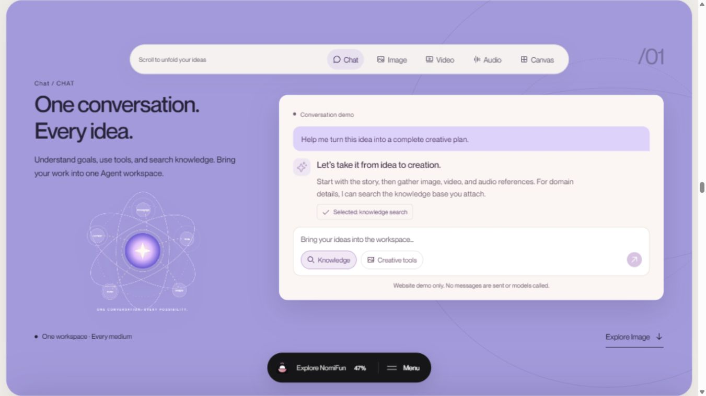
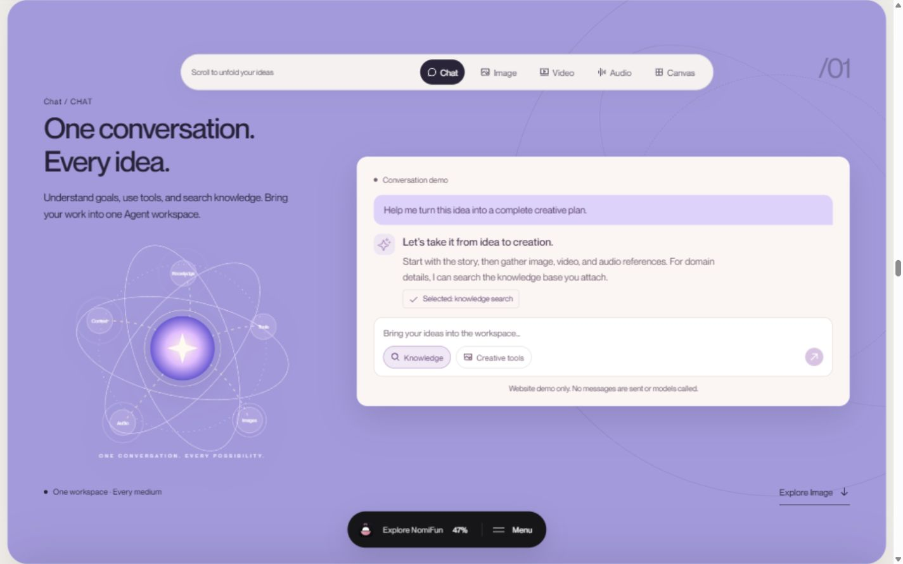
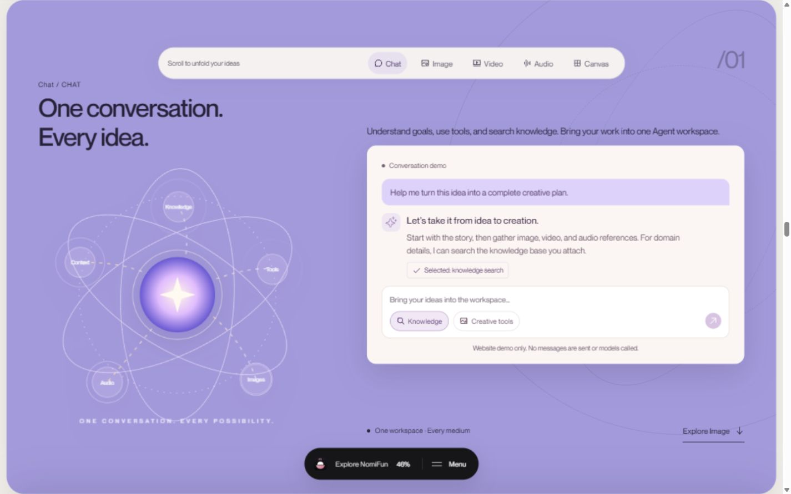
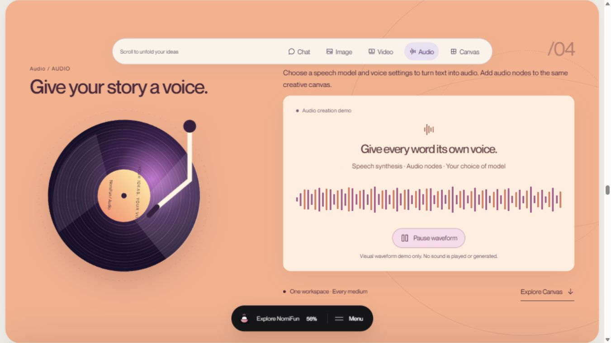

# 创作区大图构图复核

日期：2026-10-03。本轮修正前的旧版源码已随 Git 历史重建移除，修正前后截图仍保存在本文链接中。用户指出左侧星轨图缩小，削弱了页面的视觉张力。本轮使用当前运行页面重新截图和测量；主要验收仍为 1366×768、1440×900、1920×1080 标准浏览器视口，没有新增当前非标准窗口的专用规则。

## 1. 问题画面：交互正常，图形层级偏弱

原 SVG 被安排在标题与说明下方的剩余空间，并受 400px 最大宽度限制。1366×768 下，SVG 盒为 400×250.8px，实际等比绘制使用约 250.8px 的边长；1440×900 下实际边长约 377.3px。图形变成了小型装饰，右侧聊天面板占据大部分视觉注意力。

以下均为本轮在标准视口、Chat 停靠位置采集并检查的截图：

## 2. 大图构图：主视觉与完整演示各自拥有空间

左侧调整为 44% 的主视觉列，保留标题和原 SVG，图形使用独立正方形舞台。说明文案移到右侧，与聊天演示组成居中的完整内容组；底部说明与 CTA 也使用右列，左侧大图可以自然占据下方空间。没有通过 transform scale 或裁切实现放大。

| 标准视口  | 当前图形舞台  | Chat 内容区 client / scrollHeight | 完整聊天演示自然高度 |
| --------- | ------------- | --------------------------------- | -------------------- |
| 1366×768  | 420.2×420.2px | 466 / 466px                       | 397.5px              |
| 1440×900  | 506×506px     | 598 / 598px                       | 397.5px              |
| 1920×1080 | 623×623px     | 778 / 778px                       | 397.5px              |

1366×768 下，图形的有效边长约为原先的 1.68 倍，面积约 2.81 倍。说明保持 16px、聊天正文 15–17px、按钮 13px。中英文各检查上述三个尺寸：图形不与标题、聊天面板、底部目录相交，输入区、按钮和免责声明全部可见，无内部滚动条和页面横向溢出。

相同 1440×900 视口的修改前后截图已放在同一对照中检查。图形、标题、说明、聊天面板与底部 CTA 的位置关系通过；原图形的旋转、流动连线、节点脉冲和中心呼吸动效保留，因此截图中的动画相位可能不同。

其它标准视口与语言证据：

- [1366 英文](qa/creative-visual-scale/03-after-1366-en.jpg)
- [1366 中文](qa/creative-visual-scale/06-after-1366-zh.jpg)
- [1920 英文](qa/creative-visual-scale/05-after-1920-en.jpg)

## 3. 交互与相邻舞台：保持可用

Chat 的创作工具按钮点击后，回执更新为 `Selected: creative tools`。Audio 使用相同独立大图构图，1366×768 的唱片舞台为 420.2px，演示面板自然高度约 392.8px，完整落在 466px 内容区内。波形暂停后控件状态变为 `Play waveform`、Value 0；唱片和波形继续由同一播放状态控制。语言目录切换正常，中文标题与说明仍完整展示。

本轮源码仅修改 `CreativeSection.jsx` 中 Chat/Audio 说明的位置与 `creative-layout-refinement.css` 的构图。原 SVG、动效定义、100svh 卡片和 3D 压栈逻辑均保留。

## 验证边界

生产构建、内容检查、双语检查、Prettier 和差异空白检查通过；当前浏览器未记录到 error / warn。截图保存接口返回的原始 JPEG，没有裁切或修改像素。

这份记录支持当前浏览器下的图形比例、内容完整性与交互结果，不代表跨浏览器性能或完整读屏无障碍认证。图形节点文字属于原有示意图，真实操作与正文保持各自的可读字号；SVG 仍提供对应语言的整体可访问说明。
